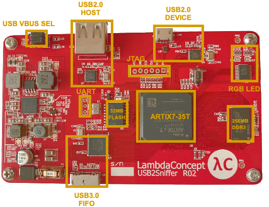

# RISC-V SBC based around the LambaConcept USB2Sniffer FPGA board

Github: [https://github.com/ultraembedded/riscv_sbc](https://github.com/ultraembedded/riscv_sbc)

## Intro
This repo contains a working RISC-V based Single Board Computer project based around the LambaConcept USB2Sniffer FPGA board.


**The board is available for purchase on the LambdaConcept shop;**  
[https://shop.lambdaconcept.com/home/35-usb2-sniffer.html](https://shop.lambdaconcept.com/home/35-usb2-sniffer.html)

The USB2Sniffer is designed to be used as a USB 2.0 capture device, or as a development board for USB 2.0 IP designs.  
It has plenty of fast DDR3 RAM and SPI-Flash, as well as USB 2.0 (Host + Device) and USB 3.0 (high speed FIFO) interfaces.

**It can be used repurposed as a single board computer (SBC) for running RISC-V Linux with both USB 2.0 host and USB 2.0 device support!**

## HW Features
* XC7A35T Artix 7 Series FPGA [xc7a35t-fgg484-1](docs/xc7a35tfgg484.txt)
* 256MB DDR3 [Micron MT41K256M16TW-107](https://www.micron.com/-/media/client/global/documents/products/data-sheet/dram/ddr3/4gb_ddr3l.pdf)
* 32MB SPI Flash [Micron MT25QL256ABA](https://www.micron.com/-/media/client/global/documents/products/data-sheet/nor-flash/serial-nor/mt25q/die-rev-a/mt25q_qljs_l_256_aba_0.pdf?rev=fa4e5a6703ba4910a5286cecad7e52db)
* USB3.0 to FIFO Bridge (up to 400MB/s of bandwidth to the FPGA) [FTDI FT601](https://www.ftdichip.com/Support/Documents/DataSheets/ICs/DS_FT600Q-FT601Q%20IC%20Datasheet.pdf)
* 2 x High Speed USB2.0 ULPI PHY [Microchip USB3300](http://ww1.microchip.com/downloads/en/DeviceDoc/00001783C.pdf)
* 3 RGB LEDs, 2 x GPIO pins



## Getting Started

#### Cloning

To clone this project and its dependencies;

```
git clone --recursive https://github.com/ultraembedded/riscv_sbc.git

```

## IP Designs Used

Most of the IP cores used in this project are designed by myself and available as easy to follow open-source Verilog modules.
The remainder (DDR3, CDC, PLL) are IP cores built with Xilinx Vivado.

| Name                   | Description                                                 | Provider |
| ---------------------- | ------------------------------------------------------------| -------- |
| riscv_top              | [32-bit RISC-V CPU](https://github.com/ultraembedded/riscv) or [Dual Issue RV32](https://github.com/ultraembedded/biriscv) | - |
| usb_host               | [Basic USB Host](https://github.com/ultraembedded/core_usb_host) | - |
| ulpi_wrapper           | [ULPI PHY Interface](https://github.com/ultraembedded/core_ulpi_wrapper) | - |
| core_soc               | [Peripherals - UART, SPI, GPIO](https://github.com/ultraembedded/core_soc) | - |
| dbg_bridge             | [UART to AXI bus master](https://github.com/ultraembedded/core_dbg_bridge) | - |
| spiflash               | [SPI-Flash XIP](https://github.com/ultraembedded/core_spiflash) | - |
| usb_serial             | [USB Device UART](https://github.com/ultraembedded/core_usb_uart) | - |
| mig_axis.xci           | [MIG DDR3 Controller](https://github.com/ultraembedded/riscv_sbc/blob/master/src/ddr/mig_axis.xci) | Xilinx |
| axi_cdc_buffer.xci     | [AXI4 Clock Domain Converter](https://github.com/ultraembedded/riscv_sbc/blob/master/src/cdc/axi_cdc_buffer.xci) | Xilinx |
| axilite_cdc_buffer.xci | [AXI4-Lite Clock Domain Converter](https://github.com/ultraembedded/riscv_sbc/blob/master/src/cdc/axilite_cdc_buffer.xci) | Xilinx |

## Current Status
* DDR3, SPI-Flash, ULPI interfaces working.
* RISC-V CPU booting Linux RV32 5.0 kernel to BusyBox userspace.
* USB Serial port implemented in the FPGA fabric for Linux console access (connected via USB micro port).
* USB Host port working under Linux (mounting USB storage devices).
* Initial source released.


[](https://asciinema.org/a/IDLP5h9RHXHBV9Y0r2BwNqaiF)